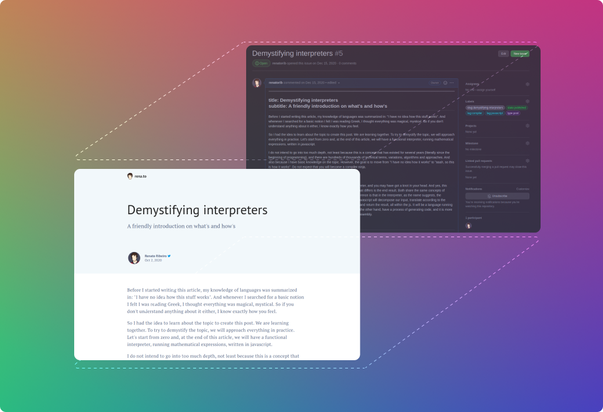

# Github Blog

<p align="center">
  
</p>

<p align="center">
  Turn your github issues into a CMS for your blog.
</p>

```sh
yarn add @rena.to/github-blog
```

## API Only

**This repository is just about the API that wraps github official GraphQL API into some useful methods.**

Note:

> If you're looking for something more 'high level', like a full-featured blog application, I'm working on a started templated using Next.js, TypeScript and Tailwindcss. [Follow me on twitter](https://twitter.com/renatorib_) to follow up and receive updates.

## Concept

The main idea is simple: each issue is a blog post entity.

Taxonomy is managed by **labels** and have `<key>:<value>` structure. Like `type:post`, `tag:javascript`, etc. Labels can be used to filter posts on querying, but is also available on post too. So you can use to add any kind of flags to your post.

The built-in label keys are: `type`, `state`, `tag`, `flag` and `slug`.

Use **type** labels to differentiate _post_ from _article_, for example.  
Use **state** labels to handle _published_ and _draft_.  
Use **tag** labels to add tags to your posts, like _typescript_.  
Use **flag** labels to add any kind of flag to your post, like _outdated_ to mark post as outdated.
Use **slug** label to define an slug to your post. [Read about slug problem](#slug-problem).

You can also add any **k:v** labels to your post, like `foo:bar`.

## Table of Contents

- [Getting Started](#getting-started)
  - [Repository](#repository)
  - [Issue](#issue)
  - [Fetch](#fetch)
- [Guide](#guide)
  - [Querying](#querying)
  - [Searching](#searching)
  - [Sorting](#sorting)
  - [Pagination](#pagination)
  - [Defaults](#defaults)
  - [Comments](#comments)
- [Problems](#problems)
  - [Slug Problem](#slug-problem)
- [API Reference](#api-reference)

## Getting Started

Let's create your first blog post.  
You will need: 1) a repository, 2) an issue with some labels

#### Repository

First, you will need to create a repository to publish your posts.

It can be private, but I recommend you to create a public since it will allow people comment and react to your posts.  
Random people will be able to create issues but they can't add labels. So you can control what posts will be shown using some label like `type:post` for example. It will prevent random people to post on your blog. Also, by core github-blog only fetches by opened issues. You can close any random issue opened by others to keep posts organized.


#### Issue

Create a issue with your content and add the labels `state:published`, `type:post`.  
Also add an label to your slug like `slug:my-first-post`.

> Tip: Your issue content can have frontmatter data


#### Fetch

Here comes github-blog. First install

```sh
yarn add @rena.to/github-blog
# npm install @rena.to/github-blog
```

Now create a new blog instance passing your repo and your github token.  
[Create your token here ⟶](https://github.com/settings/tokens).

```ts
import { GithubBlog } from "@rena.to/github-blog";

const blog = new GithubBlog({
  repo: "<user>/<repo>", // e.g.: "renatorib/posts"
  token: "<token>",
});
```

Fetch your post using getPost:

```ts
const post = await blog.getPost({
  query: { slug: "my-first-post" },
});
```

Fetch post comments using getComments:

```ts
const comments = await blog.getComments({
  query: { slug: "my-first-post" },
  pager: { first: 100 },
});
```

Fetch all your posts using getPosts:

```ts
const posts = await blog.getPosts({
  query: { type: "post", state: "published" },
  pager: { limit: 10, offset: 0 },
});
```

That's all.

## Guides

### Querying

All query works by AND logic. You can't query by OR because of the nature and limitations of github search.  
But you can exclude results using prefix `not` (`notType`, `notState`, etc.)  
E.g: If you want to query posts with type _post_ but it can't have a flag _outdated_, you can use:

```ts
const posts = await blog.getPosts({
  query: { type: "post", notFlag: "outdated" },
  pager: { limit: 10, offset: 0 },
});
```

You can also pass an array to most of query params:

```ts
const posts = await blog.getPosts({
  query: { type: ["post", "article"], tag: ["javascript", "react"] },
  pager: { limit: 10, offset: 0 },
});
```

### Searching

You can also search for post that contain terms using `query.search` param:

```ts
const posts = await blog.getPosts({
  query: { type: "post", state: "published", search: "compiler" },
  pager: { limit: 10, offset: 0 },
});
```

### Sorting

You can sort results by `interactions`, `reactions`, `author-date`, `created`, `updated`.  
All of them are desc by default but you can suffix with `-asc`. See all [in docs](/docs)

```ts
const posts = await blog.getPosts({
  query: { type: "post", sort: "interactions" },
  pager: { limit: 10, offset: 0 },
});
```

### Pagination

You can paginate using `pager.limit` and `pager.offset` as you saw before, but you can also paginate using cursors with the pager params `after`, `before`, `first` and `last`.

```ts
// first 10 posts
const posts = await blog.getPosts({
  query: { type: "post" },
  pager: { first: 10 },
});

// more 10 posts
const morePosts = await blog.getPosts({
  query: { type: "post" },
  pager: { first: 10, after: posts.pageInfo.endCursor },
});
```

> **NOTE:** `limit` and `offset` uses `first` and `after` under the hood.  
> So if you pass both `limit` and `first` or `offset` and `after`, limit and offset will be ignored.

### Defaults

You can set some defaults for querying right in your blog instance, if you want to avoid some query repetition:

```ts
const blog = new GithubBlog({
  repo: "renatorib/posts",
  token: process.env.GITHUB_TOKEN,
  queryDefaults: {
    state: "published",
    type: "post",
  },
});

const posts = await blog.getPosts({
  pager: { first: 10, offset: 0 },
});
```

### Comments

You can fetch all post comments using `getComments` method

```ts
// first 10 comments
const comments = await blog.getComments({
  query: { slug: "my-first-post" },
  pager: { first: 10 },
});

// more 10 posts
const moreComments = await blog.getComments({
  query: { slug: "my-first-post" },
  pager: { first: 10, after: comments.pageInfo.endCursor },
});
```

> **NOTE:** Comment pagination by _limit_ and _offset_ is still not possible while I figure out on how generate v2 cursors based on offset.  
> Read more about this issue here, maybe you can help.

## Problems

Github issues and Github API of course isn't designed to this kind of usage. So I ended up bumping into some limitations during the design and construction of the project. Here I list some of them and try to describe the problem and how I tried to get around.

### Slug Problem

One of my biggest disappointments. It's impossible to create a safe and unique slug for your issues.

My first attempt was to use github title to slug, and define the actual post title into issue's frontmatter.
But it doest work because:

Github only let you query for an exact repo/issue using the number of it, and I don't want to put id/number into my urls.

```graphql
query {
  repository(owner: "renatorib", name: "posts") {
    issue(number: 1) { // get issue at https://github.com/renatorib/posts/issue/1
      title
    }
  }
}
```

Github repository issues only allow you to filter using labels, states (closed/open), assignee, dates, etc. Nothing that let me use the title.

```graphql
query {
  repository(owner: "renatorib", name: "posts") {
    issues(...filters) {  // some specific filters, nothing useful
      title
    }
  }
}
```

So I was forced to use the [query search](https://docs.github.com/en/github/searching-for-information-on-github/getting-started-with-searching-on-github/understanding-the-search-syntax) that I find more powerful and I could filter by repo/owner
Now I can find the issue using title this way:

```graphql
query {
  search(type: ISSUE, first: 1, query: "repo:renatorib/posts slug-name") {
    nodes {
      ... on Issue {
        title
      }
    }
  }
}
```

But it isn't _reliable_. I can't search for an _exact_ title with query search and it could return an issue with title of `slug-name-foo` instead of the `slug-name` depending on the sort rules.

I gave up and ended using labels for that. Now I can query by exact slug:

```graphql
query {
  search(type: ISSUE, first: 1, query: "repo:renatorib/posts label:slug:slug-name") {
    nodes {
      ... on Issue {
        title
      }
    }
  }
}
```

It works. But the problem is that it isn't the ideal. Each post is a new label, it don't scale well.

### Pagination by limit/offset problem

TODO

## API Reference

See at [/docs](/docs) (auto-generated from typescript types)
